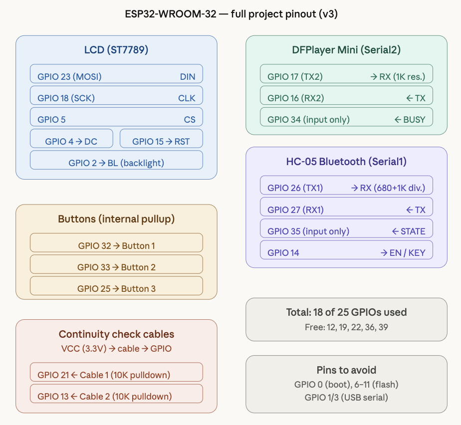
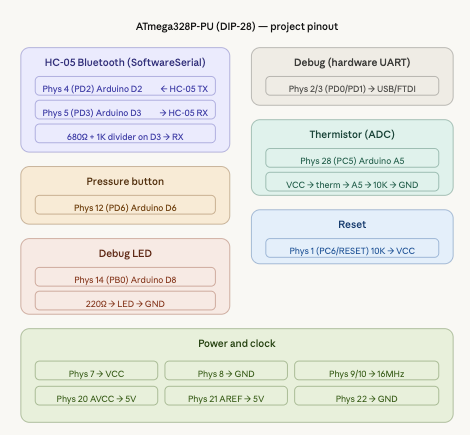

# SaveIt
The code for the SaveIt! project in ECE 1885.

# Authors:
1. Matthew Ketas
2. Caden Smith
3. Caden Empeys

# ESP32 Pinout:
## Pins

## Important Notes:
1. There must be a 1k resistor between the DFplayer TX pin and RX2.
2. There must be a 10k pull-down resistor on pin D21 and D13 (these are the inputs to the paddle cables).

# ATmega329P-U Pinout:
## Pins

## Important Notes:
1. There must be a 10k pull-up resistor on pin 1.
2. There must be a 10k pull-down resistor on pin 28.
3. There must be a voltage divider coming out of pin 5 going to the HC-05 RX (680 and 1k).
4. The crystal must be regulated with 2 22pf capacitors on pins 9 and 10.
5. STATE of the HC-05 should be connected to physical pin 6.
6. EN/KEY should be connected to physical pin 11.

# Instruction Flashing Commands
1.     avrdude -v -c usbtiny -p m328p -P usb -B 50 # This command establishes a connection between the atmega328p and the AVR programmer
2.      avrdude -c usbtiny -p m328p -P usb -B 50 -e \ -U flash:w:lcd.ino.with_bootloader.hex:i # This command flashes to the AVR programmer once the binary library has been compiled into the sketch folder in the arduino IDE